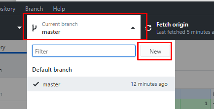
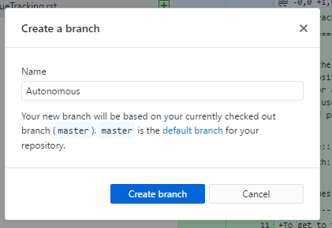
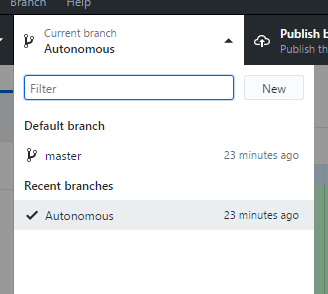
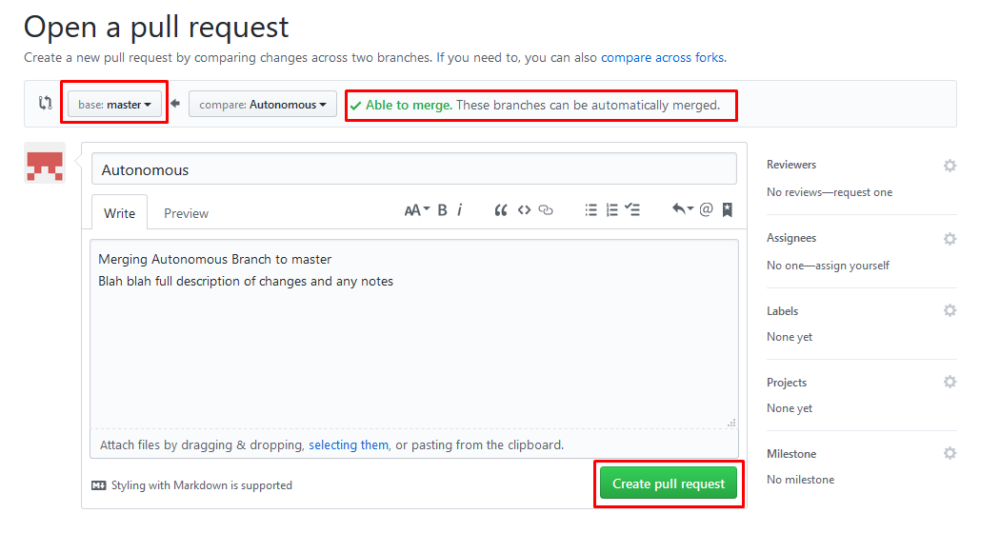

Branches
=========

A Branch of a Repository is a copy of the code that you can edit and commit changes to without affecting the original code. This new copy is called a *Branch*, and is maintained separately until the branch is remerged into the master branch.

The original branch where the main code of the repository is kept is called the *master branch*. Every repository starts with a master branch.

Why use branches?
------------------

To put it simply, all code is broken before it's tested. If everyone committed to master as they worked on different parts of the Robot Code, then at any given time the robot would be full of partially-implemented and patially-tested code. Splitting different projects into branches means that any code that is merged into the mastser branch is fully implemented, and presumable well-tested.

When a branch is merged back into the master, a *Pull Request* needs to be submitted. Only after the Pull Request is cleared is the code re-merged. This gives the team the opportunity to code review the branch and make sure that it is safe to run on the robot for competitions.

Creating a new branch
----------------------

To create a new branch, click the "Current Branch" tab above the commit history, and click "New". Make a name for your new Branch (presumably named after the feature you're implementing in this branch), and select which branch you'll be copying from (this will usually be master).

Now that you've created your new branch, you'll see that the currently selected branch has changed from *master* to your new branch. You can use this drop down to switch between branches if you ever need to.

Now you can write and commit code to your branch. Note that your new branch won't show up on the GitHub website or be available to other people until you click the "Publish" button in the top bar. This will synchronize your entire branch with GitHub, and enable others to collaborate on the branch.

Merging Branches and Pull Requests
-----------------------------------

When all of the features of a branch have been implemented and tested, and the code is properly commented, branches can be merged back into another branch or to master by submitting a *pull request*. 

Note that all pull reqests should be code-reviewed by other programming team members before any pull requests are made.

In order to submit a pull request, with the GitHub client set to the branch to merge, go to Branch>Create Pull Request. This will open your browser to a new pull request, where you can title and document the changes made in the branch. This tab will also say whether there are any merge conflicts and if the pull request can be merged automatically (for manual merging, see *Resolving Merge Conflicts*). Click "Create Pull Request" to create the pull request.

Resolving Merge Conflicts
--------------------------

When git encounters a merging issue (both branches have modified the same file), it automatically creates a merge in the following format.

Assume we have just merged Branch1 with master.

.. code-block:: java

	blah();
	<<<<<<<<< Branch1
	stuff();
	things();
	========
	perhaps();
	indeed();
	>>>>>>>>> master

The code between the Branch1 label and the equals signs is the code that git found on Branch1, and the code between the equals signs and the master label is the code that it found on the master branch.

Merging this is as simple as looking at the code and determining what goes where.

GitHub provides a tool for editing this one the Pull Request page created once the pull request is submitted.

Manually Merging Branches With WinMerge
----------------------------------------------

Sometimes codebases have to be merged manually, either because GitHub is unable to, or because the merging needs to be done at competitions where there's no interent connection. Either way, this manual merging is done with WinMerge.

After loading the 2 codebases from their respective folders, the code can be merged by going through each file and using the yellow arrows provided by WinMerge to copy chunks of code from one codebase to another. Do this for the whole codebase to merge the 2 branches.