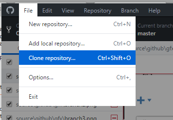
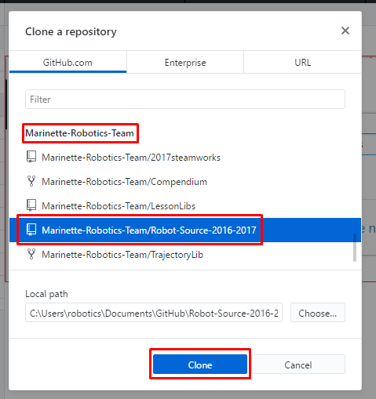
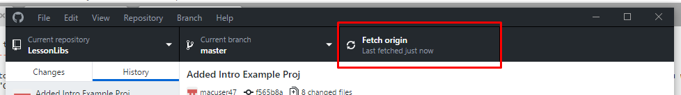

GitHub General Use
=============================

Creating a Github Repository
----------------------------

A *repository* is what GitHub calls a codebase that is stored and version controlled by GitHub.
Once you have created a GitHub account and joined the *Marinette Robtics Team* Organization, creating a new repository is simple. It is done by going to the Robotics Team page, and clicking the *New* button, and filling out the name of the Repository.

Adding a Repository to GitHub Desktop
--------------------------------------

Adding a repositoy to GitHub Desktop is done by clicking File>Clone Repository, scroll to Marinette-Robotics-Team, and clicking the name of the repository you want to add. Then click "Clone". GitHub Desktop will sync all of the necessary files.

Syncing a Repository in GitHub Desktop
----------------------------------------
To Synchronize a Repository with other changes submitted to GitHub, click the "Fetch Origin" button in the bar at the top. Any new commits will be added to your repository.

Commiting to a Repository in GitHub Desktop
---------------------------------------------

Once you have written some code and you want to commit it to the repository, first click the "Changes" tab at the upper left of the window. This will bring you to the commit screen. Make sure all of the files you have changed are selected in the main window.

Write a detailed title and description of you commit, mentioning all changes made, any bugs fixed, and any potential issues, and click the "Commit to [branch]" button. (This will either be "Commit to master", or some other branch name. Branches are discussed `here. <branches.html>`_) Then, press the "Push origin" button in the upper bar to synchronize your commit.

 .. image:: ./gfx/commit2.png
	:width: 70%

Once this is complete, clicking the "History" tab at the upper right of the window will show you the full commit history, with your new commit at the top.

 .. image:: ./gfx/commit3.png
	:width: 100%

