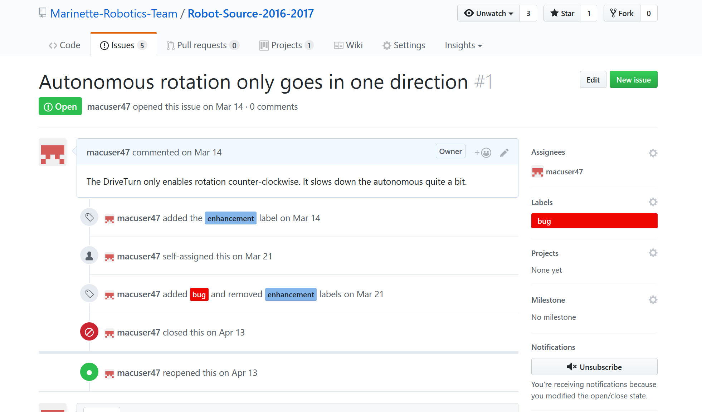
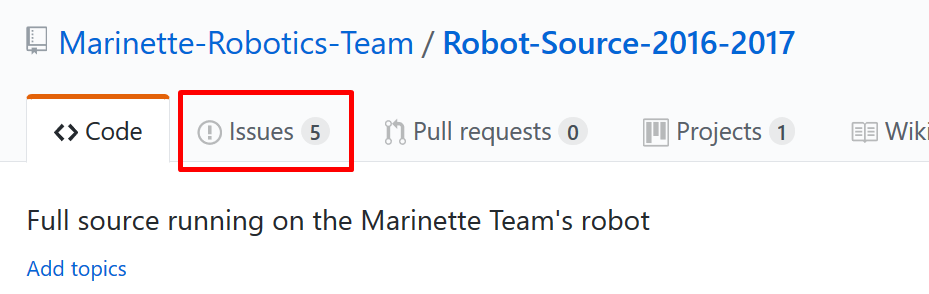
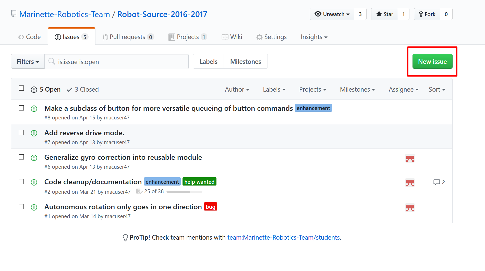
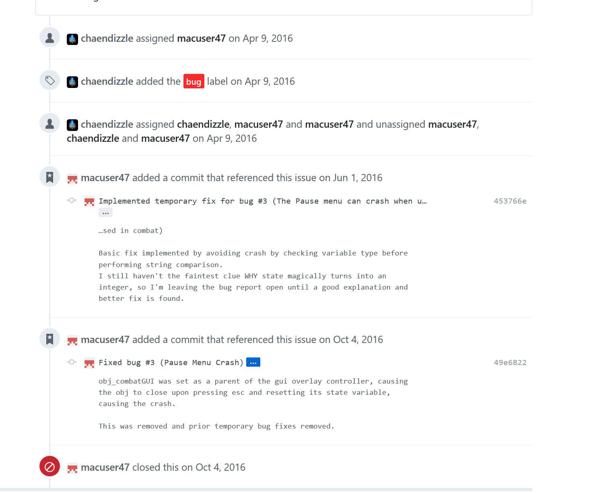
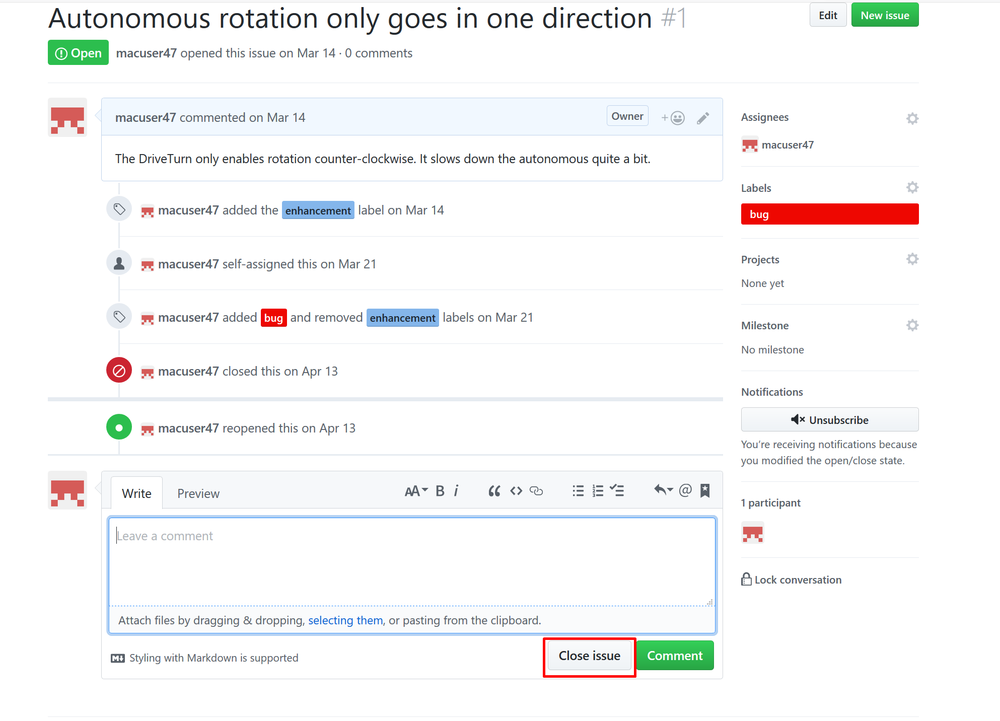

Issue Tracking
===============

One of the most useful tools that GitHub offers for its repositories is issue tracking. If a bug is discovered, or a feature needs to be added, Issue Tracking can be used to assign tasks to programmers and keep track of progress.

The Issues Page
--------------------
To get to the issues page for a Repository, click the issues tab from the main Repo page.

The issues page shows a list of the open issues [1]_, with the title, tags, and assigned users for each issue.

To create a new issue, click the "New" button in the upper right.

Formatting a new Issue
-------------------------

When writing the description and title of an issue, make sure to properly document it

- If it is a bug:
	Make sure to fully describe the bug, and include all steps to replicate the bug, if necessary

- If it is a new feature to be added:
	Fully describe how the feature should work

Additionally, you can use checkboxes to set different tasks to complete in order to resolve the issue (GitHub will automatically mark what percent complete the task is)

Try to be as descriptive as possible, and add images of necessary.

Adding **tags** to a project makes it easy to see how a project is catagorized, and can help filtering through projects.

Updating Issues
-----------------
As progress is made on a particular issue, you can use the comment system to comment specifically on an issue.

Issues can also be referenced in commits. Every issue has an *issue number*, and using #[issue number] in a commit title will automaticall link it to that issue and add the commit to the page for that commit.

Closing Issues
--------------

Issues are closed when the bug is fixed or the feature in question is implemented. This is done from the page for the issue.

.. [1] Closed issues can be viewed by removing the "is:open" filter at the top of the issues page.