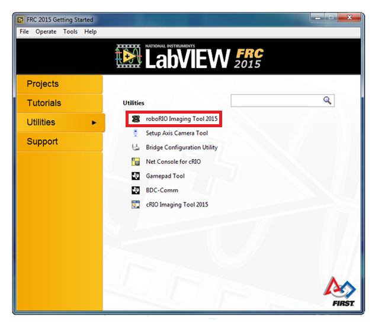
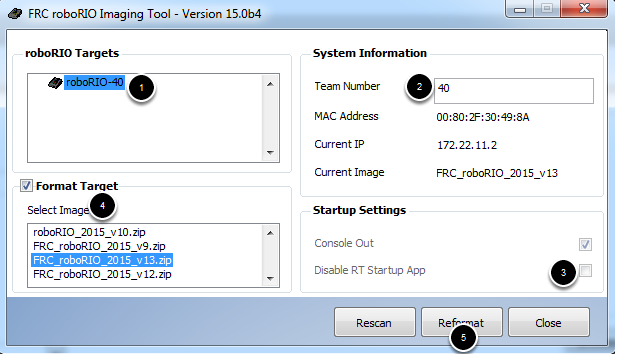
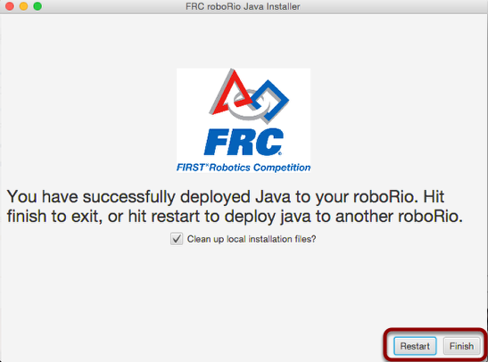

Flashing the NI RoboRIO
=========================

The RoboRIO needs to be flashed with the latest software from FIRST in order to properly load and execute robot code. This is done by flashing the FRC Linux Image, loading the latest firmware, and installing the JRE on the RoboRIO.

Note that the `FRC Update Suite <../laptops/frcupdatesuite.html>`_ is required to flash the RoboRIO.

Flashing Linux onto the RoboRIO
--------------------------------
The ScreenStepsLive instructions for this step can be found `here <https://wpilib.screenstepslive.com/s/currentCS/m/getting_started/l/144984-imaging-your-roborio>`__.

The first step is to image the RoboRIO, which is accomplished with the RoboRIO imaging tool. 

- First, plug the RoboRIO into the computer over USB.

- Then, open LabView and click the utilities tab. Then click the RoboRIO Imaging Tool.

- From the Imaging tool, click "Rescan" to scan for the RoboRIO. Once found, select the RoboRIO, and:

1. Make sure the roboRIO is selected in the top left pane
2. Enter your team number in the box in the top right
3. Make sure the Disable RT Startup App box is unchecked in the bottom right
4. Check the box to Format Target and select the latest image version in the box.
5. Click Reformat to begin the imaging process.

Wait for the imaging process to complete, which should take a few minutes.

Updating the RoboRIO Firmware
-----------------------------
The ScreenStepsLive documentation for this step can be found `here <https://wpilib.screenstepslive.com/s/4485/m/24193/l/273817-updating-your-roborio-firmware>`__. There's nothing I have to add to it, just follow the steps.

Installing the JRE
-------------------
The associated ScreenStepsLive instructions for this step can be found `here <https://wpilib.screenstepslive.com/s/currentCS/m/getting_started/l/599747-installing-java-8-on-the-roborio-using-the-frc-roborio-java-installer-java-only>`_.

Oddly enough, neither the imaging or the firmware update processes install the JRE on the roborio, so you'll need to install it using the WPILib JRE Installation tool.

Make sure you have WPILib installed on the machine you're using, as the installation utility is a part of WPILib

- First, make sure the RoboRIO is still connected over USB.

- Next, launch the FRC RoboRIO Java Installer, located at C:\\Users\\[USER]\\wpilib\\tools\\java-installer.jar

The installer will attempt to have you connect to the Oracle Java Embedded SE webpage and download Java for the RoboRIO. Follow the steps. 

.. NOTE::
	If the program encounters an error where it can't connect to the website (this will likely happen at school due to domain blocking issue on school internet), then you can download the files `here <http://www.oracle.com/technetwork/java/embedded/embedded-se/downloads/javaseembedded8u6-2406243.html>`__.

	- Download the ARMv7 Linux, SoftFB ABI, Little Endian version.

	.. image:: ./gfx/JREDownload.png
		:width: 90%

	- Click "Already Downloaded" in the RoboRIO Java Installer and select the file you downloaded.

	.. image:: ./gfx/alreadyDownloaded.png
		:width: 75%

- Create and sign in with an Oracle account, and the program will download the JRE.

.. image:: ./gfx/OracleSignIn.png
	:width: 60%

- Enter your team number, and it will search for the RoboRIO and install the JRE. This should take a minute or so.

And you're done!

Ahhh! I did everything and I'm still having issues connecting to/deploying to the RoboRIO!
--------------------------------------------------------------------------------------------

Yep, that happens. Usually, the best way to fix these issues if you can't find anything else wrong is to flash the RoboRIO again. Borked flashes happen a lot and we've had to flash a RoboRIO twice or more in the past to get it working.

