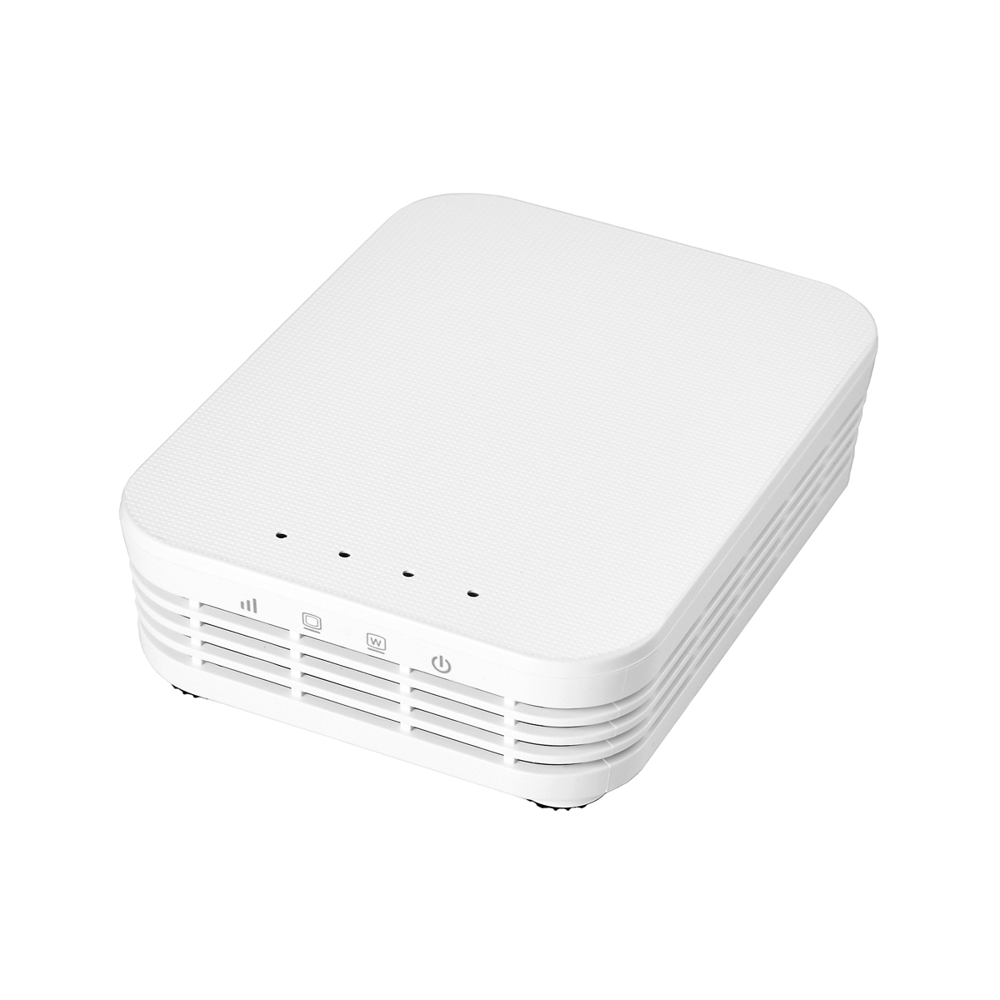
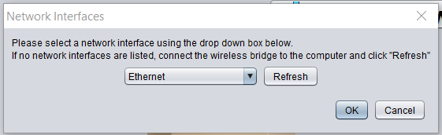
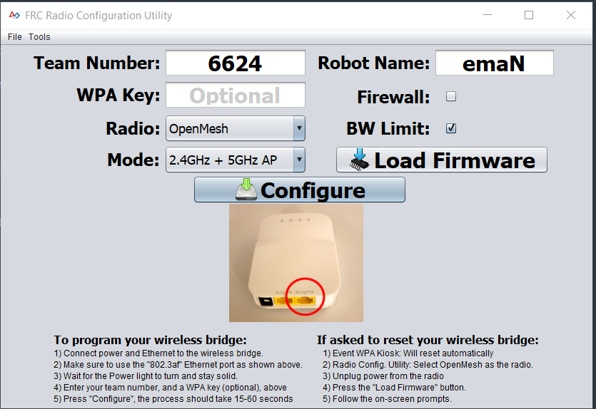

Flashing the OpenMesh OM5P-AC Router
=====================================

In order to use the OM5P router to deploy code to the RoboRIO or control the robot, it needs to be flashed with FRC firmware and team information. This is done with the `FRC Radio Configuration Utility <https://usfirst.collab.net/sf/frs/do/listReleases/projects.wpilib/frs.frc_radio_configuration_utility>`_.

- Download and Install the Radio Configuration Utility, launch it, and plug in the OM5P into the ethernet port farthest from the power jack, and plug in the power jack.

- Select "Ethernet" from the Network Interfaces dropdown and hit OK.

- Fill out the Team Number Robot Name, and WPA key and select "2.4GHz + 5GHz AP" from the Mode Dropdown.

1. Click "Load Firmware". This will install the FRC Router firmware. A popup will ask you to power cycle the router. Do so. Wait until the firmware installs.

2. Click "Configure". The router will be configured with your provided Team Number, Robot Name, and Settings. This should finish much more quickly than the firmware install.

.. WARNING::
	**The router will not function if you do these steps out of order.** It will lose its configuration settings and not broadcast a wifi signal. Make sure to load the firmware first, and then configure.

At this point configuration is complete and you are free to use your OM5P on your robot.
All IPs will be on the subnet 10.TE.AM.XXX where TEAM is the team number (so 10.66.24.XXX for team 6624).
